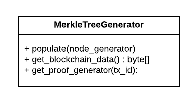

# cert-issuer class design


## Core issuing classes


The `Issuer` api is quite simple; it relies on Certificate Handlers and Transaction Handlers to do the bulk of the work.

`CertificateBatchHandler` is responsible for iterating through the certificates in a predicable order. This is critical 
because the Merkle Proofs must be associated with the correct certificate. 

- `prepare_batch` 
    - performs the preparatory steps on certificates in the batch, including validation of the schema and forming the 
    data that will go on the blockchain. Certificate-level details are handled by CertificateHandlers
    - returns the binary data that will go on the blockchain
- `finish_batch` ensures each certificate is updated with the blockchain transaction information (and proof in general)

`CertificateHandler` is responsible for reading from and updating a specific certificate (identified by certificate_metadata). 
It is used exclusively by `CertificateBatchHandler` to handle certificate-level details:
- `validate`: ensure the certificate is well-formed
- `sign`: (currently unused)
- `get_data_to_issue`: return binary data that will be hashed and added to the Merkle Tree
- `add_proof`: associatea a proof with a certificate (in the current implementation, the proof is embedded in the file)

`TransactionHandler` deals with putting the data on the blockchain. Currently only a Bitcoin implementation exists

## Signing and secret management


Finalizable signer is a convenience class allowing use of python's `with` syntax. E.g.:

```

with FinalizableSigner(secret_manager) as fs:
    fs.sign_message()

```

SecretManagers ensure the secret key (wif) is loaded into memory for signing. FileSecretManager is the only current
implemenation.

## Merkle tree generator



Handles forming the Merkle Tree, returning the data to put on the blockchain, and returning a python generator of the
proofs.

This class structure is intended to be general-purpose to allow other implementations. ()Do this carefully if at all.)